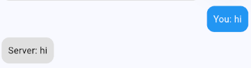

# WebSocket Chat Demo (Flutter)

This is a **simple demo screen** showcasing how to use **WebSockets in Flutter** with an **open-source WebSocket server**.

## 🛠️ What This Demo Does
- Connects to the **open WebSocket server**: `wss://ws.ifelse.io`
- Sends messages from the app to the server
- Receives responses from the server and displays them in chat

## 📡 About the Server (`wss://ws.ifelse.io`)
- It is a **public WebSocket echo server**
- **Whatever message you send**, it **sends back the same message**
- Example:

This is useful for **testing WebSocket connections** without needing a backend.

---

## 🚀 How to Run
1. Clone the project
2. Run `flutter pub get`
3. Start the app with `flutter run`

---

This is just a **basic example** of WebSockets in Flutter. You can modify it to work with a real chat server! 
